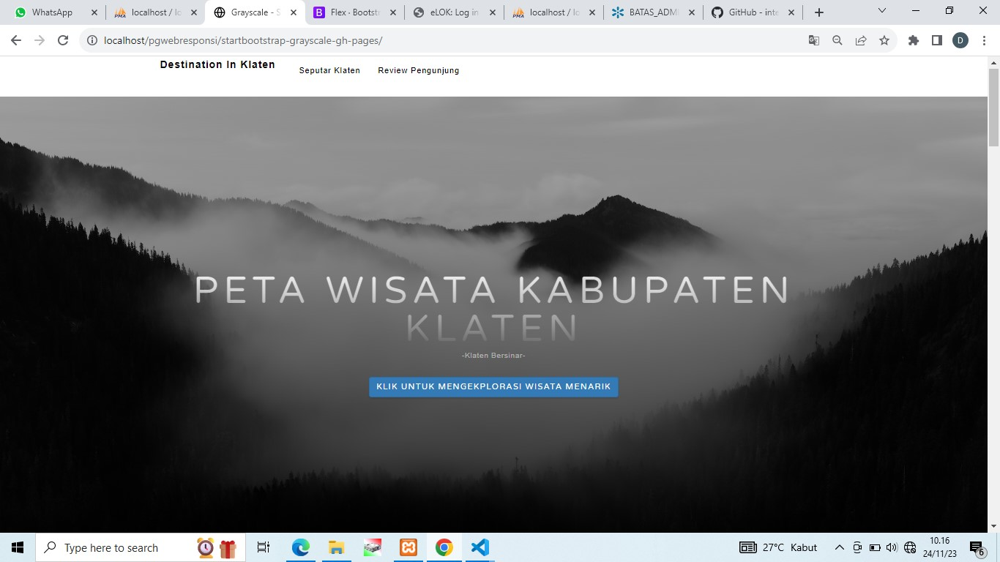
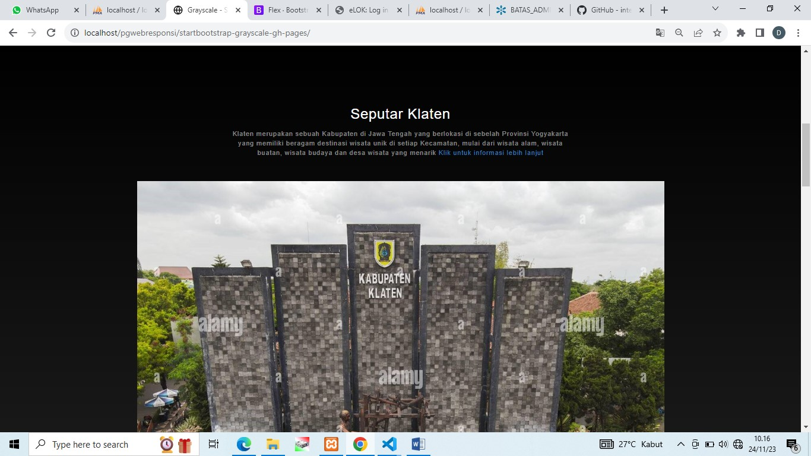
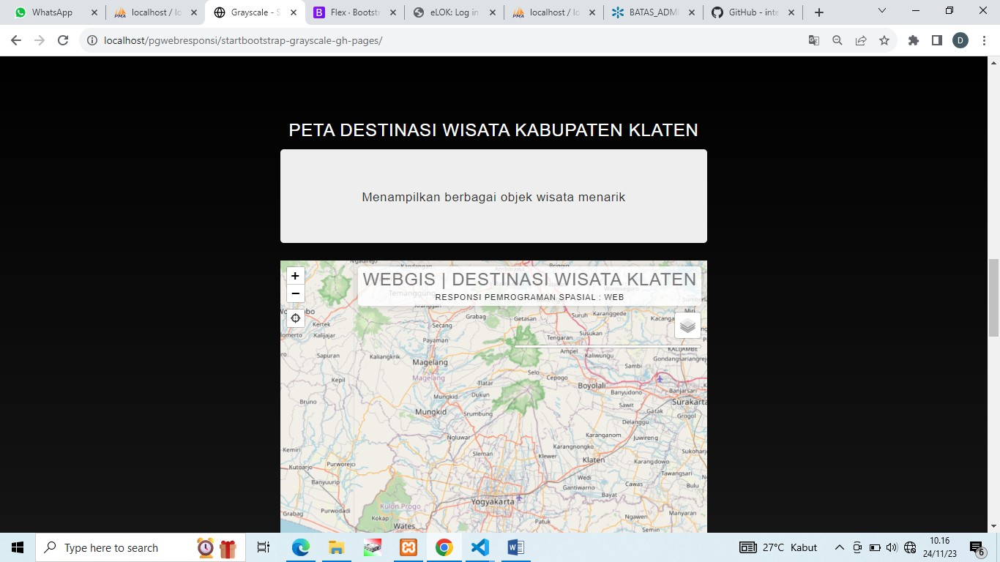
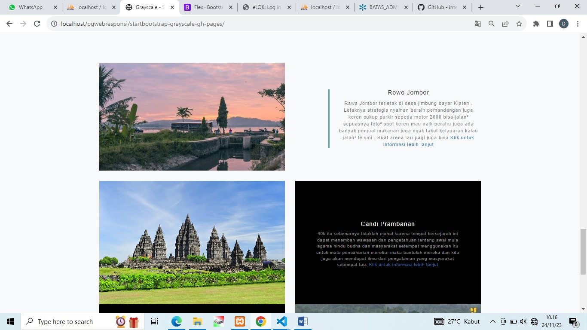
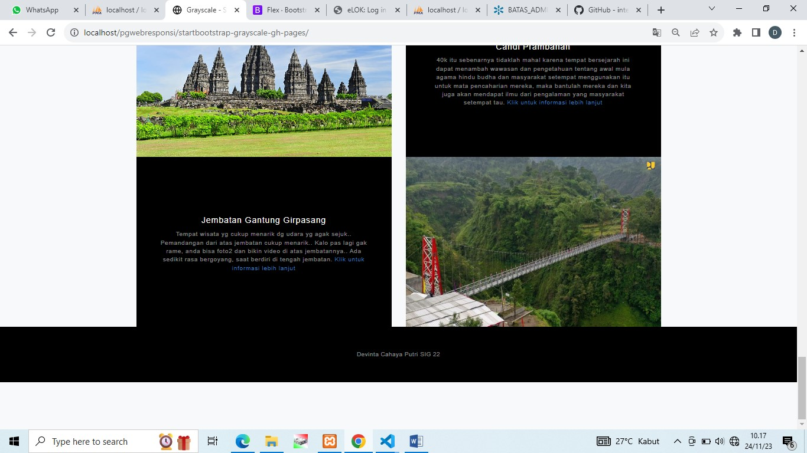
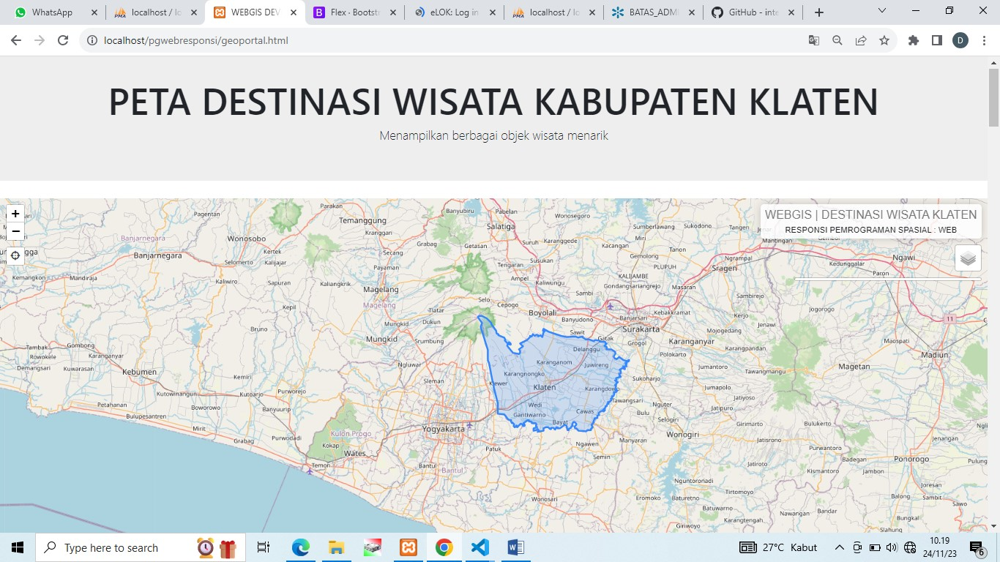
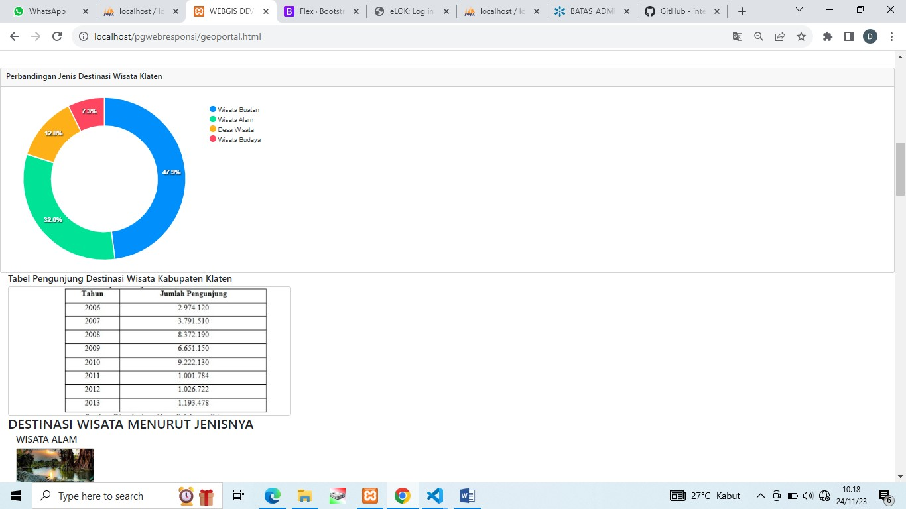
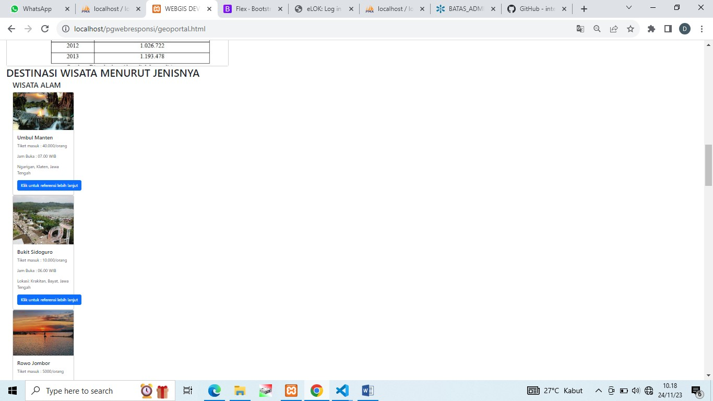
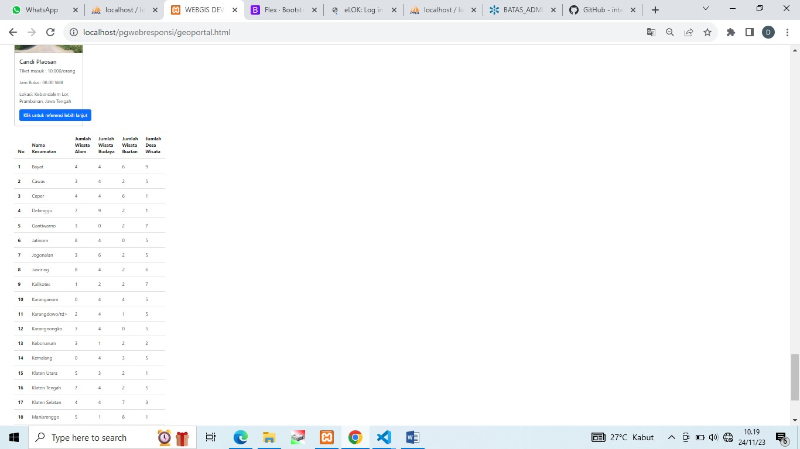

#responsipgweb
NAMA PRODUK = PETA DESTINASI WISATA KABUPATEN KLATEN
DESKRIPSI PRODUK = PETA DESTINASI WISATA KABUPATEN KLATEN BERISI TERKAIT LOKASI WISATA DI KABUPATEN KLATEN MENURUT JENISNYA, YAITU TERDAPAT WISATA ALAM, BUATAN, DESA WISATA DAN BUDAYA DI SELURUH KABUPATEN KLATEN SECARA TEKSTRUKTUR, KARENA TERDAPAT GAMBAR SETIAP OBJEK WISATA, PENILAIAN PENGUNJUNG DAN PETA WISATA YANG DILENGKAPI DENGAN MARKER LOKASI WISATA SECARA SPESIFIK DAN TERDAPAT BERBAGAI KOMPONEN PENDUKUNG LAIN UNTUK MEMUDAHKAN PENGGUNA DALAM MENGAKSESNYA.
KOMPONEN PEMBANGUN PRODUK = BOOTSTRAP, VISUAL CODE, GEOPORTAL KLATEN, GABAR OBJEKWISATA, PHPMYADMIN.
SUMBER DATA : 1. WEB BOOTSTRAP; 2. GOOGLE MAPS; 3. GEOPORTAL KABUPATEN KLATEN; 4. YOUTUBE; 5. WEB KOMPAS; 6. DATA PARIWISATA BPS KLATEN DALAM ANGKA 2022; 7. WEB SOLORAYA-SOLOPOS; 8. WEB INFORMASI SEPUTAR JATENG.
TANGKAPAN LAYAR KOMPONEN PENTING PRODUK
 
 
 
 
 
 
 
 
 
